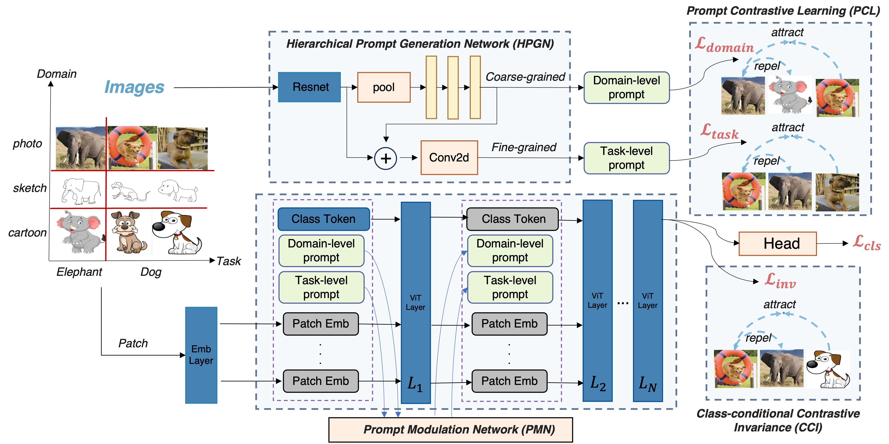

# [HCVP: Leveraging Hierarchical Contrastive Visual Prompt for Domain Generalization](https://arxiv.org/pdf/2401.09716.pdf)

This repository contains the code for the paper ["HCVP: Leveraging Hierarchical Contrastive Visual Prompt for Domain Generalization"](https://arxiv.org/pdf/2401.09716.pdf), which is accepted by IEEE Transactions on Multimedia.

## About HCVP

The Hierarchical Contrastive Visual Prompt (HCVP) method stands at the forefront of Domain Generalization (DG), leveraging the power of visual prompts to enhance model generalization across unseen domains. HCVP diverges from traditional approaches by introducing domain-level and task-specific prompts, enabling the model to better differentiate between domain-invariant and domain-specific features.
For more details, you can find them in [our paper](https://arxiv.org/pdf/2401.09716.pdf).




## 🐙 Getting Started

Clone this repository and navigate into the project directory

```bash
git clone git@github.com:jameszhou-gl/HCVP
cd HCVP
```

Create a conda environment and install the required packages
```bash
conda create --name hcvp python=3.9.12 -y
conda activate hcvp
pip install -r requirements.txt
```


## 🚀 Datasets and model

For detailed instructions, please follow the documents in [Domainbed](https://github.com/facebookresearch/DomainBed).

```bash
python -m domainbed.scripts.download \
       --data_dir=/your-data-path/
```


Our code is based on [DomainBed](https://github.com/facebookresearch/DomainBed), you can train and evaluate the model by following the instructions in DomainBed and specify the model class as `HCVP`.
- HCVP model class is located in `domainbed/algorithms.py` including *Prompt Contrastive Learning (PCL)* and *Class-conditional Contrastive Invariance (CCI)*.
- *Vit backbone* is `Vit_HCVP` in `domainbed/networks.py`
- *Hierarchical Prompt Generation Network (HPGN)* is `HierarchicalPromptNetwork` in `domainbed/prompt_network.py`
- *Prompt modulation network (PMN)* is `SimpleModulationNetwork` in `domainbed/modulation_network.py`


## :white_check_mark: Citation

If you find our work useful in your research, please consider citing:

```latex
@misc{zhou2024hcvpleveraginghierarchicalcontrastive,
      title={HCVP: Leveraging Hierarchical Contrastive Visual Prompt for Domain Generalization}, 
      author={Guanglin Zhou and Zhongyi Han and Shiming Chen and Biwei Huang and Liming Zhu and Tongliang Liu and Lina Yao and Kun Zhang},
      year={2024},
      eprint={2401.09716},
      archivePrefix={arXiv},
      primaryClass={cs.CV},
      url={https://arxiv.org/abs/2401.09716}, 
}
```

## Acknowlegdement

This code is built on [DomainBed](https://github.com/facebookresearch/DomainBed), [VPT](https://github.com/KMnP/vpt) and [ood_bench](https://github.com/ynysjtu/ood_bench). We thank the authors for sharing their codes.
